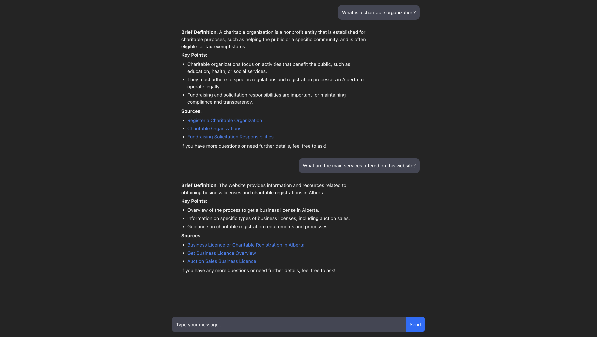
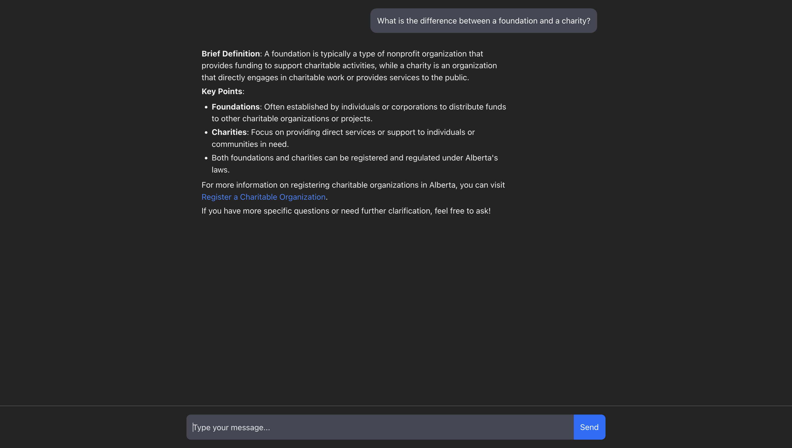
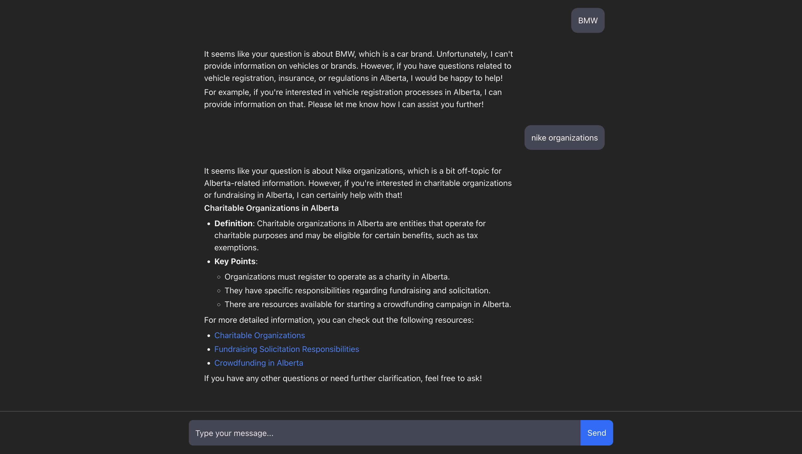
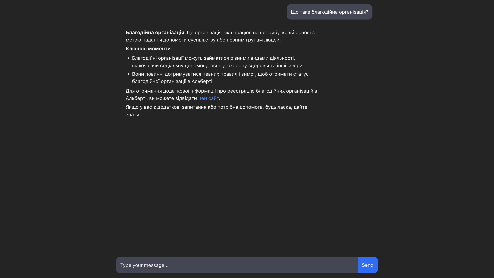

<div align="center">

# **🤖 AI Government Assistant**

**AI Government Assistant** is an intelligent helper designed to make it easier for people to find information on
government websites.  
Built with **FastAPI, OpenAI API, Qdrant**, and other modern tools.

[💻 **Source Code**](https://github.com/Yurii-Slyvinskyi/AI-Government-Assistant)


</div>

## 🚀 Features

- Semantic search across website content using embeddings
- Store and index data with **Qdrant** vector database
- User-friendly **REST API** for integration with other services
- Generate human-like answers using **LLM (OpenAI API)**
- Extensible architecture (plugins, additional data sources)
- Multilingual support

## 📝 Short Feature Presentation

As an example, this project uses data from the **Government of Alberta** website (https://www.alberta.ca/) —
specifically, the section on  
[**Non-profit and Charitable Organizations**](https://www.alberta.ca/non-profit-and-charitable-organizations-topic).

The AI Assistant is designed to:

- Help users quickly find accurate answers to their questions
- Guide users to the correct section of a website more efficiently
- Provide responses in a natural, human-like manner
- Politely redirect when questions are unrelated to the government (e.g., “What is Audi?”) by:
    - Explaining that the assistant only provides Alberta government–related information
    - Suggesting a related topic (e.g., car registration in Alberta)

## 📸 Examples (Screenshots)

### Example 1 — Definition & Sources

User asks: *“What is a charitable organization?”* and *“What are the main services offered on this website?”*

- Assistant provides a **brief definition**
- Lists **key points**
- Includes **sources with links**
- **Shows** that it searches indexed content



### Example 2 — Deeper Reasoning

User asks: *“What is the difference between a foundation and a charity?”*

- **Assistant** shows that he has deeper thinking, not just copy-paste



### Example 3 — Off-topic Question

User asks: *“BMW”* and *“nike organizations”*

- Assistant explains that it can only help with Alberta government–related topics
- Redirects user to a relevant area (e.g., how to register a car in Alberta)



### Example 4 — Multilingual Support

User asks in Ukrainian: *“Що таке благодійна організація?”*

- Assistant responds correctly in the same language



## 🛠 Tech Stack

- [FastAPI](https://fastapi.tiangolo.com/) — REST API backend
- [Qdrant](https://qdrant.tech/) — vector database
- [OpenAI API](https://platform.openai.com/) — embeddings & answer generation
- [Celery](https://docs.celeryq.dev/) + [Redis](https://redis.io/) — async background tasks
- [Docker](https://www.docker.com/) — containerization & deployment
- [React](https://react.dev/) — frontend interface
- [Pytest](https://docs.pytest.org/) — testing framework

## ⚙️ Pipeline

### User Queries

`ai_assistant_service`  
Processes user questions and returning AI-generated answers using OpenAI.

→  
`embedding_service`  
Generates embedding vectors for text using OpenAI.

→  
`qdrant_service`  
Stores vectors (embeddings) in the Qdrant database and performs semantic vector searches.

### Data Ingestion

`ingestor_service`  
Fetches, cleans, and splits website content into smaller chunks for vector embedding.

→  
`embedding_service`  
Generates embedding vectors for text using OpenAI.

→  
`qdrant_service`  
Stores in Qdrant for future semantic search and retrieval.

## 🔧 Optimization

### 🧠 Context Memory with `Redis`

### Current Workflow

Right now, the chatbot **does not remember past messages** – every user question is treated as independent.

### 1️⃣ Short-Term Memory with Redis

We can add short-term chat memory using **Redis** as a fast in-memory store.

- 🗂 Save the **last N messages** per user (e.g., last 10–20 messages).
- ⏳ Use a **TTL (time-to-live)**, e.g., keep history for **30 minutes after last activity**.
- ⚡ When the user asks a new question → fetch their previous context from Redis → append to the prompt → send to LLM.

### 🔝 Recommended Improvement Strategy

- ✅ Keep memory **short-term only** (cheap, fast).
- ⚡ Use **Redis TTL** to auto-clean inactive sessions.
- 👥 Handle **multi-user context** with `chat:{user_id}` keys.
- 📈 Scales well even with many users, since Redis is optimized for fast reads/writes.

### 📝 Ingestor Service `ingestor_service`

### Current Workflow

`IngestorService` collects pages from [Alberta.ca](http://alberta.ca/), cleans the content, splits it into semantic
chunks, and asynchronously sends them via **Celery** to another service for creating embeddings. Currently, URLs are
added manually.

### 1️⃣ Automatic URL Collection

Currently, URLs are provided manually, but this can be optimized with a Crawler service that:

- 🌐 If the site has a `sitemap.xml` – parse it and save all URLs in the database.
- 🔎 If there is no sitemap – use a crawler that recursively navigates the main page and adds internal links to the DB.

### 2️⃣ Automatic Content Updates

Right now, the service needs to be manually triggered when content changes. This can be optimized in two ways:

**a) Periodic run (Scheduler / Celery Beat):**  
Regularly check the site (e.g., weekly). If there are changes → trigger `IngestorService`.

**b) Event-driven approach:**  
React to events (new or updated pages).  
Event → `IngestorService` → content cleaning → chunking → update embeddings in the database.

**Examples of event sources:**

- 📡 Webhook from the site (API signals updates)
- ⚡ Signals (in CMS/Django when a page is published)
- 📂 File Watcher / Queue (if data is in files/documents)

### 🔝 Recommended Improvement Strategy

Combine both approaches:

- 🔄 **Periodic scan** (to ensure nothing is missed)
- ⚡ **Event-driven updates** (so changes are processed immediately)
- 📚 **Add more sources**, not limited to Alberta.ca pages only (PDFs, official guides, FAQs)

### 💠 Embedding Service `embedding_service`

### Current Workflow

`EmbeddingService` receives text chunks from `IngestorService` and creates embedding vectors using OpenAI, then stores
them in Qdrant for semantic search. When a user asks a question, the service generates a query embedding and searches
for the closest vectors in the database.

### 🔧 Possible Improvements

- ⚡ **Batch processing** – processing multiple chunks at once reduces the number of requests to OpenAI and speeds up
  embedding generation.
- 🧠 **Embedding model** – for higher accuracy, use `text-embedding-3-large` instead of `3-small`.

### 🗄️ Qdrant Service `qdrant_service`

### Current Workflow

- `EmbeddingService` receives text chunks from `IngestorService` and creates embeddings via OpenAI, then stores them in
  Qdrant for semantic search (RAG).
- When a user asks a question, the service generates a query embedding and finds the closest vectors in the database.

### 🔧 Possible Improvements

- ⚡ **Batch processing** – processing multiple chunks simultaneously speeds up operations.
- 🧠 **Embedding model** – for higher accuracy, use `text-embedding-3-large` instead of `3-small`.
- 🔄 **Alternative vector databases** – for higher load or specific cases, consider alternatives (Pinecone, Milvus,
  Weaviate), although Qdrant handles production loads well.

### 🤖 AI Assistant Service `ai_assistant_service`

### Current Workflow

This service receives user questions, forwards them to the `embedding_service` for processing, retrieves relevant
context, and generates answers using OpenAI.

Answers ensure:

- 📌 based only on the provided context;
- 🌎 support multilingual output;
- 📝 structured (definition, key points, sources, invitation to ask for clarification).

### 🔧 Improvements

**LLM Model**

- ⚡ `gpt-4o-mini` is fast and cheap, but answers may be dry.
- 🧠 `gpt-4o` or `gpt-4o-large` → improves human-likeness and answer accuracy.
- 🔀 Can combine: fast mini for simple questions, large model for complex or ambiguous queries.

**Prompt / Instructions**

- ✍️ Clearly define tone and style (friendly, expert, consultative).
- 🧑‍💼 Add roles and context instructions (e.g., “You are a consultant for Alberta government services…”).
- 🔍 Add checks for off-topic or incomplete data, so the model always provides useful information.

**Optimization**

- 💾 Cache embeddings for popular queries to avoid repeated OpenAI requests.
- ⏱️ Limit tokens in the prompt for faster rendering.

## ⚡ Quickstart

### 📋 Prerequisites

Before running the project, make sure you have the following installed:

- 🐳 [Docker Desktop](https://www.docker.com/products/docker-desktop)
- 📦 Docker Compose (comes with Docker Desktop)
- 🧬 Git
- 🔐 `.env` file with all required environment variables  
  _(see `.env.example` in the repository for reference)_

### 🐳 Install Docker

1. Download and install [Docker Desktop](https://www.docker.com/products/docker-desktop) for your OS (Windows, macOS, or
   Linux)
2. **Start Docker Desktop manually**
3. Verify that Docker is running by running the **following command**:

```
docker info
```

### ✅ Verify Docker Installation

If you see output with information about `Server`, `Containers`, `Images` — you're good to go ✅

If you get an **error** like:

```
Cannot connect to the Docker daemon at unix:///var/run/docker.sock. Is the docker daemon running?
```

🔧 Make sure Docker is **running**
(on macOS — open **Docker Desktop** and wait until it fully starts)

### 🚀 Steps to Run the Project

#### 1️⃣ Clone the Repository

```
git clone https://github.com/Yurii-Slyvinskyi/AI-Government-Assistant.git
cd AI-Government-Assistant
```

#### 2️⃣ Create `.env`

Copy the examples files `.env.example` in every backend service and frontend:

```
cp .env.example .env
```

**Fill in all** the environment variables based on **your own keys**

#### 3️⃣ Start Docker Containers for Development

```
docker compose up --build
```

⏳ The first launch may take a few minutes — Docker images will be built, migrations will run, and services will
initialize

#### 4️⃣ Done!

The API will be available at 👉 http://localhost:3000/

#### 💡 If you get errors or Docker doesn’t start — make sure Docker Desktop is running and fully loaded

## 🧪 Testing

To run tests, use:

### ai_assistant_service:

```
docker compose -f docker-compose-test.yml run --rm ai_assistant_tests
```

### embedding_service:

```
docker compose -f docker-compose-test.yml run --rm embedding_service_tests
```

### ingestor_service:

```
docker compose -f docker-compose-test.yml run --rm ingestor_service_tests
```

### qdrant_service:

```
docker compose -f docker-compose-test.yml run --rm qdrant_service_tests
```

## 📬 Contact me

#### 📞 +1 (780) 224 7457

#### 📧 [yura.programing@gmail.com](mailto:yura.programing@gmail.com)

#### 💼 [LinkedIn](https://www.linkedin.com/in/yurii-slyvinskyi-827831284)

#### 📷 [Instagram](https://www.instagram.com/yura.prg)

#### 💬 [Telegram ](https://t.me/yurassslyv)